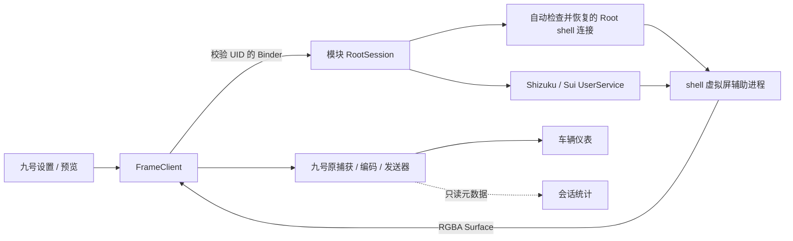

# 架构与统计

## 进程边界

Hook 和 UI 在九号进程；授权 API 仅在模块进程使用。模块持有会话与服务连接，shell 辅助进程创建并持有 VirtualDisplay。ADB Shizuku 直接启动 shell 子进程；UID 0 的 Shizuku / Sui 与 Root 模式在 app_process 启动前使用 `su 2000`，保持包名 `com.android.shell` 与实际 Binder UID 一致。

UserService 仅接受拥有者模块 UID，启动类和 APK 路径来自自己的安装信息；调用者不能传入命令或任意 APK。一次服务仅启动一个会话，使用独立 tag，避免旧连接清理移除后来会话。停止、Binder 死亡和超时均有回收路径。UserService 使用 API 13+ 的 Context 构造器。

`HookCatalog` 是模块依赖的九号目标的唯一清单（类、带参数模式的方法、布局与控件 id），`VehicleHooks` / `TirePressureHooks` 的类名常量都引用它。Application 附加后在后台线程按所有类加载器解析一遍，结果写入日志 `HOOK CHECK`、模块摘要和设置页；版本门禁只放行 `HookCatalog.VERSIONS` 里逐项核对过的构建（6.10.10 / 610104038 与 6.10.11 / 610114116；6.10.11 去掉了网易加固、直接带 22 个明文 dex，其类集合、目标类的字段与方法签名、依赖的四个布局和控件 id 与 6.10.10 完全一致），其他版本的缺失项会被具体列出。`RegisterProbe`（core）是调试用的寄存器表：候选名单、每个寄存器最近回复的字节与小端值、回复/变化时间、是否有读取在途、上次是否无回复；`VehicleHooks` 在发出、回复、超时时更新它，`FrameClient` 保存要探测的名单（`probe_registers`，默认全部）并在每次 HUD 脉冲把快照交给 `DashboardHud`，HUD 在开关（`WidgetSettings.REGISTER_PROBE`，默认关、迁移不开启，只在“关于”解锁调试模式后出现）打开时于画面左侧画出两列表格：在途读取琥珀色、3 秒内变化绿色、无回复灰色，每秒重新编码一次以刷新“几秒前”，不拦截触摸。读取按 250 ms 一个轮流进行且同一时刻只有一条探测读取在途，只在值变化时另记一条 `PROBE` 日志；无回复的寄存器沿用两次静默即静音的规则。“全索引扫描”通过反射向 `DynamicCommandFactory.commandConfigMap` 加入 `xdis_1a` 这类合成的 `CommandConfig(name, module, "read", index, "2", …)` 条目，让九号自己的 `hasCommand` / `sendCommand` 路径读取配置里没有命名的寄存器；注入只改本进程内存中的表，条目均为两字节只读。表格超出 58 行时按 `RegisterProbe.prioritized` 取最近变化、其次最近回复的行。`RideState`（core）保存按间隔主动读取的 `rSpeed`（0.1 km/h）与 `rPower`（总线上是无符号 16 位，按有符号解释，动能回收为负；显示条件按绝对值比较）：两者都在 3 秒内、速度不超过 `holdSpeedMax`（km/h，默认 0）且功率原始值在 (`holdPowerMin`, `holdPowerMax`]（默认 100–300）之内，并由 `HillHoldDetector` 确认连续满足 `holdSeconds`（默认 1 秒）后才判定坡道驻车，条件连续不满足（含读数过期）同样达到 `holdSeconds` 才解除；速度与功率按各自的读取间隔（`speedIntervalMs` / `powerIntervalMs`，0.5–15 秒，默认 1 秒）读取，只要速度、功率卡片或驻车避让需要就会读。`HillHoldDetector` 只接受 `RideState.Snapshot`，即车辆自己的 `rSpeed` / `rPower`；BMS 读数从不写入 `RideState`，「BMS 优先」只换掉功率卡片的显示值、显示条件和曲线采样。速度、功率卡片与电压卡片共用 `drawMetric`（一行数值加可选曲线，尺寸相同），在栈中位于电压之上；`SidebarLayout.arrange(…, dodge=true)` 先按含通知抬升的正常布局算出每张卡片的位置，凡与提示框 `HILL_HOLD_TOAST`(574,372)–(848,462) 纵向相交的卡片保持高度、右边缘移到提示框左侧 6 px，其余卡片按原顺序从提示框上沿向上重新堆叠；通知卡片存在时必然盖住提示框，渲染与触摸判定同样左移 `dodgeShift()`；手机状态的内容以卡片自身右边缘为锚，随卡片一起移动，卡片动画照常，`DashboardOcclusion` 在虚拟显示器预览里同步画出提示示意。开关 `WidgetSettings.HILL_HOLD_DODGE` 由偏好版本 3 引入，默认开。`VehicleHooks` 还从九号自行轮询的 `rBool` 第 0 位得到开机状态并写入日志。

核心计算类放在 `core/`，不依赖 Android UI；`client/` 管理独立的帧、控制及设置工作线程；`ui/` 只组织界面。跨包的公开方法是工程内部调用边界，不是稳定的外部 SDK。

## 服务绑定与授权

客户端使用 `FrameBridgeService.class.getName()` 生成绑定目标，避免包结构调整后仍拼接过期路径。主机测试核对该目标与 Manifest 的导出服务一致。模块进程没有常驻守护：它只在九号 `bindService(BIND_AUTO_CREATE)` 时被启动，九号退出即解绑并可被系统回收；手机、音乐、音量采样都只在九号请求快照时进行，进程内没有周期任务，唯一能让它在九号之外存活的是系统为通知监听器保持的绑定。`BindingState` 统计从未连上的绑定代数；`ServiceBridge` 在 `bindService` 返回 false 或连续超时未回调时，把 HyperOS / MIUI 的自启动提示附在状态文本里（按 `ro.mi.os.version.name` / `ro.miui.ui.version.name` 或小米系品牌判定），设置页在这类系统上多一个“自启动设置”按钮，依次尝试 MIUI 应用权限编辑器、自启动管理页和系统应用详情页。

遵循 [官方 API 接入指南](https://github.com/RikkaApps/Shizuku-API#guide)，Manifest 中的 `ShizukuProvider` 在模块进程初始化 Sui；不在九号进程请求 Sui Binder，也不重复调用 `Sui.init`。模块服务创建时注册进程级 Binder received/dead 和 permission result 监听，不持有 Activity。收到 ready 回调后才启用授权请求，检查已授权状态与 `shouldShowRequestPermissionRationale`，仅由显式按钮操作调用 `requestPermission`。

请求期间用原子状态阻止重复申请；结果、错误或 Binder 断开会更新状态。授权窗口以 1.5 秒间隔读取状态，保留未保存的授权模式选择；关闭窗口时移除刷新回调。自动读取期间收到授权 / 保存点击时排队一次，不重复提交。状态读取不触发系统授权弹窗。

## 通知与手机状态

`MirrorNotificationListener` 在模块进程通过系统通知使用权读取新增事件，只接纳用户勾选的包；跳过分组摘要和无文本通知。`NotificationContent` 优先解析 [MessagingStyle 消息列表](https://developer.android.com/reference/android/app/Notification.MessagingStyle.Message#getMessagesFromBundleArray(android.os.Parcelable[]))，不读取 historic messages。`NotificationDeduplicator` 按会话记录消息时间、发送者、正文及相同消息出现次数，只输出新增项。首次遇到多条未读消息时记住整个快照，仅展示最新一条；后续快照可同时输出多条新增消息。相同内容、相同时间的多条消息按出现次数区分。普通通知退回 `Notification.when`、标题和正文。系统重新发布时间 `getPostTime()` 不作为新消息依据，因为 [Telegram 会重新发布各会话通知](https://github.com/DrKLO/Telegram/blob/master/TMessagesProj/src/main/java/org/telegram/messenger/NotificationsController.java)，并保留旧消息自身的时间。

不导入 `getActiveNotifications()` 历史。通知正文仅限内存，标题和正文分别限长 120/240 字符，不进入诊断。去重记录最多保留 128 个会话，每个会话最多 64 种消息。`NotificationHub` 保留最多 32 个事件，每次经过验证 UID 的 HUD_SNAPSHOT 最多携带 8 个事件及 32×32 图标。九号使用独立工作线程每 200 ms 读取，电话和网络查询不占用采集、控制或设置线程；进程、会话或设置修订变化重置游标，不重放上一会话，旧会话迟到结果被丢弃。

`NotificationSettingsActivity` 是不导出的模块 Activity，由九号设置按钮经 Binder 获得不可变 PendingIntent 后打开。系统授权授予模块 UID；应用列表使用模块 `QUERY_ALL_PACKAGES` 查询当前用户所有已安装应用。列表在工作线程读取，已勾选项优先，各组内按应用名排序。设置由模块私有偏好保存，总开关默认关闭、包列表默认空。时长使用 5–30 秒整数滑块，默认 15 秒，旧配置超出范围时夹到边界。电话状态权限由该 Activity 单独请求。

启动应用选择使用独立且不导出的 `LaunchAppPickerActivity`，不依赖通知使用权。九号通过校验 UID 的 Binder 获取一次性不可变 PendingIntent，在模块 Activity 获得焦点后执行已安装应用查询，再读取 MAIN/LAUNCHER 入口，使 OEM 应用列表授权可以在选择启动应用时处理。授权弹窗返回焦点后最多自动重读一次，也可在应用权限页授权后返回刷新。选中的组件通过 ResultReceiver 返回，九号仅修改当前应用选择，保留未保存的显示参数；关闭选择器不保存任何设置。`QUERY_ALL_PACKAGES` 是 Manifest 可见性声明，不传入 Android `requestPermissions()`。

`PhoneStatus` 最多每秒采样一次电量、充电状态、Wi-Fi 连接以及活动卡槽的信号等级，不读取电话标识、号码、SSID 或位置。没有 Wi-Fi 且当前网络是蜂窝数据时还报告默认数据卡的网络代际（`getDataNetworkType`，并用 `TelephonyDisplayInfo` 的覆盖类型识别 NSA 5G），HUD 以 13 px 粗体把它画在 Wi-Fi 图标的槽位（22 px）里。手机状态卡片以右侧的电量百分比为锚：电池图标紧贴其左侧 6 px，再往左是 Wi-Fi/网络类型槽位与 SIM 信号，宽度随之变化。缺少电话状态权限时明确使用未知信号；系统读取失败不编造满格数据。

九号 `DashboardHud` 按 848×480 参考坐标等比绘制。`SidebarLayout` 为绘制和触摸共用的几何定义：最新通知靠右下方 (right=838, bottom=468)，旧通知向上排列；手机状态位于通知上方，再往上依次是音乐、胎压、电压；间距 6。卡片进入时上推整个控件列；退出时每个槽位都移动到下边界，整组移除也不会突然留下高度差。`NotificationTimeline` 使用 elapsedRealtime：440 ms 滑入、340 ms 队列移动、240 ms 滑出，离场卡片占用名额直到退出；同时显示条数来自通知设置（1–5，默认 3），调低时多出的旧卡片立即开始退出，等待中的卡片在名额空出后进入。卡片高 60、槽距 66，因此三条通知把上方控件抬高 198。消费者挂起后过期卡片直接清除；清空操作同时移除等待队列。每条新增消息独立生成卡片与计时，source key 仅用于手机通知被移除时清除对应卡片；HUD 按事件序号忽略重复读取，避免传输重试生成重复卡片。新通知卡片缓存为不可变 Bitmap，动画不依赖源应用继续重绘。本地预览使用同一绘制器，编码输出的去重标记包含 HUD 修订及动画时点；调试图绕过所有 HUD。虚拟显示器预览还在 HUD 之上绘制 `DashboardOcclusion`：按实拍标定的车机右上角仪表卡片示意 (640,44)–(842,254)，只出现在手机预览，车辆会话不绘制。

`MusicStatus` 使用模块通知监听器 ComponentName 调用官方 [getActiveSessions](https://developer.android.com/reference/android/media/session/MediaSessionManager#getActiveSessions(android.content.ComponentName))，在单独线程每秒最多采样一次，优先播放中的会话。没有授权时不访问媒体会话；没有元数据时保留未知字段。专辑图缩至 64×64，变化时增加 revision，只有客户端尚未持有对应 revision 时才通过 Binder 传输。不读取远程 URI，不保存或记录媒体内容。

右侧控件最宽 190：手机状态双卡时占满 190（两张卡从左边缘排起，多余空间留在第二张卡与 Wi-Fi/网络槽位之间），单卡或无卡时按内容宽度并保持右边缘 838 对齐；音乐、胎压和开了曲线图的电压固定占满 190，关闭曲线图的电压按 `电压 888.8 V` 模板取窄宽度，宽度只随设置变化，不随实际数值抖动；未播放时不显示音乐卡片，胎压一行若超出宽度则横向压缩而不裁切。宽度由 `DashboardHud` 测量文字得到，`SidebarLayout` 只做钳制与右对齐，触摸判定使用同一组已到位的矩形。自下而上为手机状态、音乐、胎压、电压；手机状态高 28、音乐有曲目时高 84、胎压 28、电压开曲线图 84 否则 28；全部打开、音乐展开且曲线图打开时，音乐顶边 366、胎压顶边 332、电压顶边 242。无会话、已停止或错误状态下不绘制音乐卡片；打开“自动隐藏”时音乐只在曲目、会话或播放/暂停变化后展开 `musicHideSeconds`（3–15 秒，默认 5），到时收起，上方控件下移补位。每张卡片由 `CardMotion` 驱动：布局目标变化时位置与尺寸在 300 ms 内缓动，出现时淡入并从下方 10 px 升入，消失时淡出并下沉 220 ms，会话的首个布局直接就位；通知抬升量直接叠加在静止布局之上，卡片随通知动画即时跟随。动画期间 HUD 修订号按 50 ms 递进。电压曲线取最近 `chartSeconds`（10–60 秒，默认 30）内每次收到的读数（每个接收时间一个样本，最多保留 60 秒、600 个，跨会话保留），在卡片下半部分按时间横向、按自动缩放的电压区间纵向绘制折线与淡色填充，并标出区间最高、最低值；有两个以上样本时每秒重新编码一次。音量条位于左下角 (14,150)–(46,376)，在车机自己的音量图标上方：`VolumeStatus` 在模块进程监听 `android.media.VOLUME_CHANGED_ACTION`，并在每次快照时轮询媒体音量兜底，快照带序号、等级和最大值；HUD 在序号变化时让音量条从左侧滑入（260 ms），停留 2.2 秒后向左滑出；停留期间再有变化只延长停留并在 150 ms 内平滑改变填充高度，滑出途中的变化就地折返；会话首个快照只记录不显示，音量条不拦截触摸。上推后的控件可能进入原车 Overlay 区域；模块无法遮住车辆在接收帧之后叠加的信息。音乐按 PlaybackState 的 position、speed 和单调时钟时间推算进度，暂停不推进、未知位置不伪造，显示不超出 duration。暂停图标叠加在专辑图中央，不显示文字播放状态和播放控制按钮。不读取或显示媒体会话音量。音乐只读取会话快照，不发送媒体控制命令；预览仅在当前可见 HUD 矩形内消耗触摸，关闭的控件和空隙不拦截。

`WidgetSettings` 另保存卡片顺序 `order`（`widget_order` 键：分界线 `COLUMN_DIVIDER`=0 之前是右列自下而上的控件标志，之后是左列自下而上的标志；通知块只能在右列，规范化时会被移回右列底部）和每个控件的显示条件 `WidgetCondition`（`condition_<flag>` 键，编码为 20 个整数：模式、触发位、显示秒数、检查位和八组区间，即速度、功率、电压、音量、前后胎压（0.1 bar）、前后胎温；处于滑块端点的界限视为无界，旧的 12 整数编码仍可读取）。条件有三种模式：始终显示；条件变动时（音量变动、歌曲变更、播放状态变更触发后显示若干秒，`DashboardHud.fire` 为每个等待该触发的控件开一段窗口）；满足条件时（速度、功率、电压、音量、胎压、胎温区间与“正在播放”全部成立，缺少或过期的读数视为不成立）。`DashboardHud.visibleMask` 综合开关、数据是否存在与条件得到可见集合，交给 `SidebarLayout.arrange(settings, visible, …)` 按 `order` 自下而上排列：右列在 648–838，左列在 443–633（`LEFT_COLUMN_LEFT/RIGHT`）；通知块占据它在右列顺序中的位置，只有排在它上方的右列卡片被顶起，而左列整体从通知块上沿、驻车提示框上沿和所有被避让挤到左边的卡片上沿之上开始堆叠；右列（含避让重排后）顶部伸进 `SidebarLayout.INSTRUMENT`(640,44)–(842,254) 的卡片改入左列，按其原中心高度插到左列比它低的卡片之上，右列变矮后自动回去（顺序变动的卡片以抬升后的位置作为动画目标），渲染时按“抬升布局与静止布局之差”逐卡片位移，通知卡片按 `Stack.notificationBottom` 整体平移。音乐旧有的自动隐藏开关只作为音乐卡片没有显式条件时的默认条件保留。

`WidgetSettings` 保存在九号私有 SharedPreferences（版本 5；版本 5 之前保存的驻车最短持续重置为新默认值）：六个控件开关（手机状态、胎压、电压、音乐、通知、音量），胎压的前后胎，电压的曲线图，音乐的自动隐藏，以及胎压、电压、速度、功率四个读取间隔（胎压 5–60 秒，其余 0.5–15 秒，默认 30 秒与 1 秒）、音乐展开时长（3–15 秒，默认 5 秒）以及电压、速度、功率各自的曲线时长（10–60 秒，默认 30 秒）。版本 1 保存的掩码在读取时自动补上版本 2 新增的开关。由 `WidgetSettingsDialog` 编辑，胎压、电压、音乐子项共用 `WidgetOptionsDialog`，通知一行的“设置”打开模块的通知设置界面；保存后即时应用到 `DashboardHud`，无须跨进程读取。禁用的控件没有布局占位。禁用通知清空动画队列，但仍推进收件游标，恢复展示不会重播期间的消息；原有模块端通知总开关、权限及包过滤仍同时生效。隐藏音乐、胎压和电压只关闭绘制，不改变数据观察流程；只要胎压或电压卡片开启，就在车辆投屏或虚拟显示器运行期间通过九号读取接口刷新；旧掩码里的 `TYRE_READ` / `VOLTAGE_READ` 位保留但不再起作用。

模块只注入九号的主进程（`MirrorModule.mainProcess`，`:pushcore` 等辅助进程不装 hook、不建桥接）。九号进程用 `ServiceBridge` 绑定模块的 `FrameBridgeService` 把模块进程拉起来；系统拒绝绑定（`bindService=false`，ColorOS / HyperOS 等的关联启动管理）时按 1、2、4、8 秒退避重试，并调用 `RootBridgeProvider` 的无副作用 `ping` 尝试让系统以 ContentProvider 方式启动进程，成功即立刻重绑；`ServiceBridge.hyperOs()` 识别 MIUI / HyperOS、ColorOS / OxygenOS / realme、vivo、华为 / 荣耀，设置页据此显示“自启动设置”按钮，`AutostartPages` 依次尝试各厂商的自启动页面并回退到应用详情。`ui.ModuleActivity` 是唯一的启动器入口，只提供自启动、通知使用权两个系统页面和回到九号的按钮，目的是让 ROM 把模块列进自启动管理并视为用户打开过的应用。

更新检查：`core.UpdateCheck` 解析 tag（`v1.2.3` / `1.2.3`，忽略后缀）、按数值比较版本、把 GitHub 的 release JSON 缩成版本和页面（draft / prerelease 忽略，缺页面时退到 Releases 列表）；`service.UpdateChecker` 在模块进程的后台线程 GET `api.github.com/repos/Margele/NinebotEnhance/releases/latest`，最多 6 小时一次、失败 1 小时后再试，结果存 `update_check` 偏好，`Protocol.UPDATE_CHECK` 只回缓存并在过期时顺带发起一次查询。九号侧 `DirectCastController` 在非巡航页到前台后 3 / 20 / 60 秒最多问三次，`newer` 且该版本未被忽略（`.widgets` 的 `update_ignored`）、本进程未提示过时，在车辆页（按钮行所在页面）弹一次窗：打开 Releases、忽略此版本或关闭；设置页顶部的「更新到 x.y.z」按钮用同一份缓存。模块不下载 APK。

`bms.BmsController` 是模块进程里第二条自有 GATT 链路（DL 模块 BMS，服务 FFE0、写 FFE1、通知 FFE2）：连接后请求 MTU 247、订阅通知，用本地生成的 secp256k1 密钥对做 FC00 交换（`core.Secp256k1` 纯 BigInteger 实现，共享密钥即乘积的 X 坐标，前 16 字节为 AES 密钥、后 16 字节为 IV），之后按 `BmsSettings.pollMs` 轮询 FC17（`core.DlBmsProtocol`：A5 5A 00 40 请求头、≤4 字节内容字节反转、16 位累加和、整帧 AES-128-CBC 零填充；应答攒满 16 的倍数再解密，按头部长度取整帧），读数进 `BmsState`/`BmsData`，随仪表快照的 `bms` 包（`notification.BmsBundle`）到九号进程；只写 FC00 和 FC17。HUD 的 BMS 卡由 `BmsCardPainter` 画：`BmsCard.Layout` 最多三行、每行若干字段等分宽度，空行隐藏，无新读数时一行“BMS 未连接”，高度经 `SidebarLayout.Sizes.bmsHeight` 进入排版；`WidgetSettings.VOLTAGE_FROM_BMS` / `POWER_FROM_BMS` 让电压、功率卡片和条件在 BMS 读数新鲜时改用它并把曲线采样切到 BMS；`WidgetCondition.BMS_CONNECTED` 是新的“满足条件时”检查项。链路生命周期与大灯相同（`hold(source, ms)` 三个来源）：只在投屏会话、九号界面可见或 BMS 界面持有期间存在，最后一个持有到期即断开、停止轮询并回到 `IDLE`。

`TirePressureHooks` 只观察 6.10.10 / 6.10.11 的 `TirePressureStateParser` 和 `DeviceManager`。解析器 init 绑定车辆身份；蓝牙 onResponse 期间使用 ThreadLocal 收集 parseExtraFloat 实际命中的四个字段，原调用完成后发布，不将其他车辆报文或无关报文视为更新。压力按原生逻辑乘 0.02、温度减 40。网络路径仅查询成功 Response 已展开的 tp_list 缓存，按 tp_position=1/2 确认前/后轮，且在所选车辆蓝牙已连接时跳过；同一 Response 使用弱身份表去重。无新增网络、BLE 命令或传感器绑定操作。

`TireTelemetry` 在九号进程内保存最多八辆车的不可变快照，投屏开始时固定车辆，不跨 Binder 传送车辆身份。每个字段独立保存接收的墙钟时间和单调时钟时间；卡片不显示接收时间；接收时间超过 2 倍胎压读取间隔的字段显示为 `--`，重复云端值不推进时间，过时回复不能覆盖更新的蓝牙值。未知值保留为空；过期状态进入 HUD 帧修订，源应用不重绘时也能更新显示。日志只报告数据来源和年龄，不记录车辆标识或完整网络响应。

`VehicleHooks` 只观察 6.10.10 / 6.10.11 的 `DynamicDevice.onResponse(NbFrame)`，这是九号所有蓝牙读取回复的必经点。仅处理指令标签为 `rVoltage` / `rVoltage2` / `rVoltage3`、`rVrlaVoltage`、`rTirePressureRealTimeInfo` 以及九号自己轮询的 `rBool` 且设备 SN 等于当前所选车辆的帧；`rBool` 的 256 / 512 / 1024 位表示三个锂电位是否有电池，与九号电池页 readLiBatInStatus 的判断一致，模块据此选择要读的 BMS 电压寄存器；仪表板的 `rVrlaVoltage` 是实测总线电压，90 秒内有回复时优先上卡片，BMS 寄存器只作交叉核对（实测锂电 M5 P 的 `rVoltage3` 恒为标称 7200）；各电压寄存器都按 10 mV 小端解码，超出 10–200 V 的载荷被忽略；胎压实时帧按车型 `tire_pressure` 特性的布局解码（寄存器 1 低字节后胎压、高字节前胎压，寄存器 2 同序为温度，再乘 0.02 与减 40），原始字节为 0 视为无传感器样本。每种标签的首帧原始字节写入日志以便实机核对。主动读取复用九号自己的 `DynamicDevice.sendCommand(name, null, addToFirst=true, timeoutRetry=0, callback)`：在车辆投屏或虚拟显示器运行期间、所选车辆已连接且胎压或电压卡片连同各自的“主动读取”打开时进行，指令先经 `hasCommand` 过滤，胎压按胎压间隔（默认 30 秒）、电压按电压间隔（默认 1 秒）分别调度，只读取已开启的卡片，每条指令未回复前不再重复发送，连续两次无回复的指令在本次会话内静音；仪表板电压有回复时，BMS 电压寄存器每 60 秒只读一次作交叉核对；实测 M5 P 千万台纪念版对 bms1 的 `rVoltage` 从不回复，铅酸版本的电压在仪表板 `rVrlaVoltage`，与九号电池页按 smart_vrla 选择的路径一致。另有 6 秒看门狗清理从未回调的读取。插队与不重试保证每条读取最多占用九号指令分发器一个配置超时（1 秒），不会排在投屏期间可能堆积的其他指令后面。之所以要主动读取，是因为九号详情页的 3 秒胎压轮询在巡航页覆盖期间停止；日志中的 `VEHICLE no reply` 表示车辆在该超时内没有回复，诊断摘要里有发送、回复和未回复计数。它不发送写入指令，也不改变九号自身的轮询。为了不依赖 ADB 就能诊断投屏期间的蓝牙状况，模块日志记录每条指令前 2 次发出、前 3 次回复以及每会话前 20 次未回复和耗时（50 ms 内失败表示指令未构建或被拦截，1 秒左右表示九号指令超时），并在会话期间每 60 秒写一行总线统计：九号分发的指令数、收到的回复数和被 `DynamicDevice.intercept` 拒绝的指令数，按指令名计数；`onResponse` 观察到的自有标签帧每种最多每 30 秒记录一条，SOC 探测帧总是记录。

`BatteryTelemetry` 与胎压快照使用相同的合并规则：按车辆隔离、投屏期间固定车辆、保留接收时间、过时或重复的值不能覆盖更新的蓝牙值。卡片不显示接收时间；胎压字段超过 2 倍胎压间隔、电压超过 5 倍电压间隔没有新数据时显示 `--`。HUD 修订号只包含各字段的过期标志，静止画面只在数值或过期状态变化时重新编码。M5 P（车型 14103）的动态配置没有电池温度指令，卡片不显示温度；温度只存在于九号电池页的服务器接口中，见 [电池数据读取调查](battery-data-research.md)。

通知宽度和同时显示条数保存于模块的通知设置，宽度默认 312、范围 180–600（848×480 参考坐标），条数默认 3、范围 1–5，都用拖动条调整，随九号的每次快照传给 HUD；卡片内容、右对齐位置、动画起点和进度条均跟随宽度。手机状态栏始终显示完整电量和网络状态，省去左侧装饰手机图标。

## 统计采样位置

- RGBA：`FrameClient.readImage` 成功复制帧后计数。预览重绘不计入。
- 供帧：原捕获入口成功接收模块画面时计数。可能涉及多个捕获调用，UI 因此标为次数。
- 编码：限定在 `cn.ninebot.capture.encoder.EncodeListener` 实现的带字节载荷回调（包括九号 `ScreenCastRequest` / `DeviceScreenCastRequest` 里接收所有编码器输出的匿名回调，它们在 capture 包之外，按类名列入种子），若提供 `MediaCodec.BufferInfo` 则按 offset / size 读取大小并忽略 codec-config。没有提供 BufferInfo 时只计参数实际可见范围，不猜测整数参数含义。
- RTP：限定最后一跳，Wi-Fi 的 `jlibrtp.RTPSession.sendTo(byte[])`（UDP 数据报）与蓝牙的 `NBBleSender.sendRtp(byte[])`（GATT 写入），读取 RTP v2 头和载荷参数范围；排除 RTCP、截断头和错误 padding。九号 `RtpSender` / `BluetoothRtpSender` / `NBBluetoothRtpSender` 的 `send(byte[],int)` 收到的是分片前的整帧，单独计为“发送帧”。没有消费 ByteBuffer 或修改 payload。
- 链路反馈：`NormalSendQueue.putFrame` 之后读取其 `mGiveUpFrameCount`（队列满时放弃的帧；清空队列后计数从零重新累加，模块按增量汇总）；`FrameSender.onAPPPktReceived` 的 RTCP APP 子类型 1 计为仪表丢包报告，2 / 3 记录仪表请求的帧率 / 码率（小端 32 位）；Wi-Fi 的 `RtpSender.RRPktReceived` 记录接收报告的丢包比例（1/256）与累计丢包。

编码与发送分别固定本会话首次实际命中的方法，忽略嵌套的其他层，避免同一数据在多层调用被重复累计。原调用异常或明确返回 false 不计入；协程返回只代表方法提交，不能据此证明无线发送成功。RTP 帧按 SSRC / timestamp 的不同结束标记计算，缓存 128 个最近标记；重复提交仍计入包数和字节数。

该 APK 的业务代码有保护，当前静态文件能确认类名，但统计方法的具体签名需在运行时反射匹配。遇到不兼容的回调形态或不暴露原始 RTP 的发送器时显示未命中，不将采集帧或估算数据冒充发送统计。

`StreamStats` 记录每次会话累计值，使用 200 ms 桶计算最近约两秒速率；终止后冻结累计时长、清零实时速率。Hook 在进入原方法时捕获会话统计对象，迟到回调不能混入新会话。日志只记录方法签名及计数，不保存载荷。

## 隐藏功能

九号的动态设置项由 `DynamicViewHolder` 子类承载，每一项的可见性无论来自默认值还是 `visible_condition`（对车辆功能位寄存器如 `rFunBool5` 的判断），最终都经过 `DynamicViewHolder.updateVisible(Object)`。`FeatureHooks` 在该方法上把配置标题键（`getConfig().getTitle()`，如 `string.neg_throttle_reverse`）属于 `HiddenFeatures` 解锁列表的行参数改为 `true`，其余行原样放行；开关保存在 `.widgets` 偏好的 `unhide_throttle`。模块不发送任何蓝牙指令：用户在被显示出来的行上拨开关时，是九号自己按配置写 `sBool_0xFD` 的对应位（bit32768 倒车、bit4096 无缝倒车、bit8192 辅助制动），车辆固件若未开放该功能可能忽略。

原版巡航按钮：九号 `NavigationCardViewHolder.updateCruiseViewState(boolean)` 按 `<车架号>_support_cruise` 能力标志显示或隐藏卡片上的 `ivCruise`，其点击监听始终绑定（模块的“全屏投屏”就是调用它）。`FeatureHooks` 在解锁开启时把该方法的参数改为 `true`，按钮显示后点击即为九号原生巡航投屏，模块没有会话时不替换任何画面（`FrameClient.replace` / `draw` 只在 VEHICLE 会话内生效），偏好键 `unhide_cruise`。

手机导航上仪表：`NaviSender` 在 VEHICLE 会话期间由 `FrameClient` 的 50 ms 脉冲驱动，数据来源二选一：“控件管理”底部的“手机导航上仪表”（偏好键 `navi_live`，默认开）用导航 App 的实时状态，“巡航导航测试数据”（调试区，偏好键 `navi_test`，默认关）用脚本路线，测试开关优先。实时状态的链路：导航 App 进程里的 `NaviAppHooks` 把高德引擎事件 1 解析成 `NaviUpdate`（`AmapNavi.parse`，高德的 `curManeuverID` 与九号 NaviState 编号一致，直接透传），经 `NaviAppClient.publish` 以 `Protocol.NAVI_UPDATE` 送到模块服务的 `NaviHub`（`CallerPolicy.allowedFor` 只允许导航 App 调 REPORT 和 NAVI_UPDATE），九号进程的 `FrameClient` 在 `hudPoll` 里每秒 `NAVI_SNAPSHOT` 取最新一条，8 秒内没有新状态视为导航结束并停止发送。发送器每秒一次在自己的线程里通过九号 `DynamicDevice.sendCommand(name, payload, addToFirst=false, timeoutRetry=0, callback)` 写 TFT 板指令 113 的数据：开始时 `setNaviDistance`（int32 全程 m）和 `setNaviRoad`（UTF-8 加 0），下一路名变化时 `setNaviRoadNext`，每秒 `setNaviInfo`（18 字节：int32 剩余 m、int32 剩余 s、int16 图标、int32 当前段剩余 m、int16 红绿灯数、int16 GPS 等级）和 `setNaviDriveInfo`（int32 已行驶 m、int32 已用 s）。全程距离变化（新路线）时重发 `setNaviDistance`，当前路名变化时重发 `setNaviRoad`。脚本在 `NaviTestData`：3 km、8 m/s、每 500 m 一段换一个转向图标和下一路名，跑完后保持“到达”图标。`setNaviStart 3` 由九号巡航页自己发，模块不发开始 / 结束指令；每条指令先经 `hasCommand` 过滤，会话结束、开关关闭或状态过期即停止，日志前缀 `NAVI send`。腾讯和百度目前只有探针日志，格式确认后接入同一条链路。分析依据见 analysis/导航数据下发分析_6.10.10.md。

导航 App 探针：`scope.list` 把高德（`com.autonavi.minimap`）、腾讯（`com.tencent.map`）、百度（`com.baidu.BaiduMap`）加入作用域，`MirrorModule` 在这三个包里只创建 `NaviAppHooks`，不装九号的任何 Hook。`NaviAppClient` 绑定模块服务并把 `NAVI` 报告转发进导出日志。各 App 的观察点：高德的原生引导引擎 `com.autonavi.jni.eyrie.amap.tbt.NaviManager` 向所有注册的 `NaviEventReceiver` 广播 JSON 事件（带 `eventType`），模块用高德自己的无参接收器类 `HiCarXbusEmitter$a` 实例化一个接收器注册进去并拦截它的两个回调（对该实例不再执行原方法），另记录 `AjxModuleCarProjection.notifyOngoingCard` 的 JS 推送；百度记录 `JNIGuidanceControl.getSimpleMapInfo / getRemainRouteInfo / getCurRoadName / getAssistRemainDist(Bundle)` 填好的 Bundle（键见 `RouteGuideParams.RGKey.SimpleGuideInfo`：`resid` 转向图标、`remain_dist`、`road_name`、`TurnKind`、`totaldist`、`totaltime`、`cur_road_name`）；腾讯记录实现 `TNaviCarCallback` 的类的 `onUpdate*` 调用（`onUpdateRoadSigns`、`onUpdateTurnIcon`、`onUpdateSegmentLeftDistance`、`onUpdateLeftTime`、`onUpdateLeftDistance`）。日志量由 `EventCensus` 限制：每种事件前 3 条全文，之后每 50 条一条，每分钟一行计数。

仪表按键卡片：车辆页的每张卡片都由 `DynamicViewModels.Companion.generateView(parent, type, json, deviceId, deviceTag)` 构建，`FeatureHooks` 观察这个调用取得工厂对象、方法和该页的 deviceId / deviceTag（`FrameClient.DynamicViewFactory`），`VehicleCardInjector` 在自己那一行按钮下面用同一个工厂构建九号的 `ext_meter_virtual_key` 卡片（配置 `HiddenFeatures.HARDKEY_CONFIG`），约束到行下方并解除行的底部约束；工厂或解锁状态变化时 `DirectCastController.rescanCards` 重新扫描已挂载的卡片，关闭解锁后卡片被移除并恢复行的约束。卡片自身还受九号按车辆保存的开关 `HardkeyRemoteControlVisibilityStore.isVisible(deviceTag)`（偏好文件 `hardkey_remote_control_visibility`，默认关）控制，构造时按它把自己设为 GONE，因此 `FeatureHooks` 在解锁开启时让该方法返回 true，不改写九号保存的偏好。卡片上的按键是九号自己的 `setHardKey`（tft 板 idx 37，`[键, 动作]`：上 1、下 2、左 3、右 4、中 5、音量加 11、音量减 12；短按 1、长按 4），偏好键 `unhide_hardkey`。

## 预览统计与编码覆盖

`StreamOverlay` 把 `StreamStats` 快照格式化为三行文本（码率 / 带宽，帧率 / 目标帧率 / 帧数，丢帧 / 丢包），`FrameClient.drawInline` 在 HUD 之后画在手机预览左上角；编码供帧走的是 `FrameClient.draw`，叠加层因此不会进入编码画面。带宽优先取最后一跳的 RTP 字节速率，未命中时退回发送帧速率，两者都未命中显示 `--`。目标帧率取覆盖值，否则取编码器接受的配置（`EncodingDiagnostics.targetFps`）。

`EncoderOverride`（`.widgets` 偏好的 `encoder_bitrate_kbps` / `encoder_fps` / `preview_stats` / `encoder_frame_width` / `encoder_frame_height`，码率 100–3000 kbps 按 50 kbps 步进，帧率 5–30）的码率与帧率只作用于车辆会话的编码器；`frameWidth × frameHeight`（0 × 0 = 按投屏配置）只替换 `FrameClient.frameWidth()` / `frameHeight()` 返回的合成整帧，预设 240×320 / 848×480 或自定义，九号编码给车辆的尺寸不变，合成帧仍按 `Geometry.fit` 等比放进它的位图。码率与帧率的作用方式：`EncodingHooks` 在 MediaCodec `configure` 前改写 `KEY_BIT_RATE` / `KEY_FRAME_RATE`，hook `VideoConfig.getVideoBitrate()` / `getFrameRate()` 让 FFmpeg 路径、编码循环的初始帧率和 PTS 计算沿用同一值，hook `LoopBitmapEncoder.getMInterval()` 让循环每次迭代都按覆盖帧率取图；保存时对本会话已登记的编码器调用 `setParameters(PARAMETER_KEY_VIDEO_BITRATE)` 即时改码率，帧率改动从下一次循环生效。没有投屏（只跑虚拟显示器）时三个 hook 都原样返回。

M5P 的仪表配置文件（TFT 板 `screen_cast_config`）是 Wi-Fi Direct、H.264、1.5 Mbps、20 fps。巡航投屏的 H.264 走 `CodecCaptureController` → `FFmpegImageReaderEncoder` / `FFmpegViewEncoder` → `FFmpegBitmapEncoder`，编码器名 `h264_mediacodec`（九号常量 `CODEC_H264_GPU`），FFmpeg 通过 JNI 包装调用 Java `MediaCodec`，所以模块的 MediaCodec 观察器能看到它的 configure；`BitmapToH264Encoder`（直接 MediaCodec）不在这条路径上。这条路径的 `restart(int,int)` / `restart(boolean)` 会响应仪表的 RTCP 2 / 3 / 1 并重建 recorder（码率下限 1 Mbps），重建时读取的是编码器自己的字段而不是 `VideoConfig`；因此 `EncodingHooks` 还 hook 了 `NbFFmpegFrameRecorder.setVideoBitrate(int)` / `setFrameRate(double)`，在车辆会话且覆盖开启时把参数替换成覆盖值并记一条 `OVERRIDE recorder` 日志，这样每次重建都回到覆盖值，仪表的请求只会触发一次重建而不会改变结果。

## 采集节奏

`FramePacer.TARGET_FPS=20` 同时用于 VirtualDisplay 的 `setRequestedRefreshRate`、Surface 的 `setFrameRate` 和模块 50 ms 读取间隔。刷新请求 / 提示不当作实际采集统计，原九号编码器参数仍从原会话读取。

ImageReader 的回调仅安排读取：首帧立即处理；下一时点前的多个通知合并为一个延迟任务，任务到期才 `acquireLatestImage`，获取并复制当时最新的画面。队列等待期间不持有已取得的 Image，读取后由 try-with-resources 关闭。该方式避免把 49 ms 到达的 20 FPS 帧直接丢掉；旧式“距离上次不足 50 ms 就丢帧”在 49/51 ms 抖动下可能退化到约 10 FPS。

成功复制后按本次读取开始时间安排下一时点，不把复制耗时再次叠加到 50 ms 间隔；队列为空不更新期限、不产生虚假帧。每次仅有一个待处理任务，关闭 reader 时移除回调并重置 ticket，旧任务不能消费新会话的 ticket。所有调度状态都在帧工作线程中访问，长时间阻塞后只读取最新帧，不补发积压次数。系统、渲染或工作线程阻塞仍会使实测值低于 20 FPS，需要用设备日志确认。

## 原会话编码日志

`EncodingHooks` 在九号进程只读监听 MediaCodec 和 `cn.ninebot.capture` 初始化入口。`DirectCastController` 在调用原巡航按钮前启动 `EncodingDiagnostics` 会话，虚拟屏开始供帧时沿用它，避免漏掉更早的编码器配置。框架 Hook 只采纳来自九号捕获调用链、捕获上下文或已登记实例的视频编码器，不把其他播放解码器当成投屏编码器。

原始 `VideoConfig` 只读取有界的实例数值字段，其他捕获类只读尺寸 / 帧率 / 码率等相关字段；不执行 getter、目标对象的 `toString` / `hashCode` / `equals`。重载签名及整数参数位置原样保留，未验证字段不冒充最终编码尺寸。FFmpeg 等非 MediaCodec 路径只记录可见配置，不能从这些日志推断其全部原生编码行为。

编码器接受 `configure` 后记录请求格式，`start` 后安全读取输出格式，并观察应用自身的 `getOutputFormat`、同步 `INFO_OUTPUT_FORMAT_CHANGED` 和异步 `onOutputFormatChanged`。请求 FPS 支持 Integer / Float，输出格式缺少 FPS 不覆盖它。输出尺寸及有效 crop 单独记录，编码器缓冲区对齐尺寸不直接等同可见区域。`setParameters` 只记录数值白名单作为运行中参数事件，不覆盖最初 configure 的请求值。API 语义参见 [MediaCodec](https://developer.android.com/reference/android/media/MediaCodec) 和 [MediaFormat](https://developer.android.com/reference/android/media/MediaFormat)。

同步出队和异步输出回调只读取 BufferInfo。忽略配置包、空 EOS，分片字节累计但完成时才计一帧，以最近 128 个完成 PTS 排除重复，允许时间戳乱序；不读取 / 消费编码载荷。`RATE` 按本次日志间隔计算，`STREAM` 沿用约两秒的采集 / 回调 / RTP 窗口。每约 10 秒记录一次、结束时补最终累计值；尚未观察到接口时速率为“未读取”。这些数字仍不是仪表接收或显示帧率。

元数据以请求标记和弱引用对象身份隔离；调用前保存标记，停止或换会话后不接纳旧结果。同一会话重新配置会清除旧输出格式；旧会话编码器不自动归入新会话。上限为每会话 16 个编码器、32 个原配置来源、128 个弱编码器身份关联；保留完整配置副本到下一次启动供日志分享。部分受保护配置、未覆盖的异步调用或其他进程 / 原生编码路径可能无法关联，保持“未读取”，不从默认虚拟屏参数推测。

## 日志文件与关于页面

设置底部提供“关于、日志、关闭、保存”。摘要直接使用九号进程中的本地状态及模块摘要缓存，服务失联时也能打开。查看日志不自动修改剪贴板。

`LogExporter` 在单独的工作线程导出，8 秒后 UI 超时返回；迟到结果不会弹出分享窗口，卡住的请求不再创建额外工作线程。`FrameBridgeService` 先验证调用方 UID，然后由模块将当前模块日志写入私有缓存草稿，向九号返回追加写入的 `ParcelFileDescriptor`。九号追加原会话配置、连接状态和本地日志，关闭描述符后请求完成。日志正文不经过 Bundle 字符串传输，不使用旧的 96,000 字符尾部裁切。

完成请求必须匹配原 UID 和一次性 token。模块复制生成不可变的 TXT 快照，再授予九号该 URI 的读取权限。`LogShareProvider` 不导出，只允许通过 URI 授权读取指定文件；拒绝写入、草稿、任意路径和过期文件。系统分享 Intent 同时携带 `EXTRA_STREAM`、`ClipData` 和只读权限，接收方由用户在系统窗口选择。方案遵循 [Android 文件分享与 URI 授权](https://developer.android.com/training/secure-file-sharing/share-file)。

文件为 UTF-8。每个进程原有环形日志仍保留最多 240 条、每条正文最多 1,600 字符；“完整”指完整导出当前保留内容，不能恢复已淘汰事件。单文件超过 4 MiB 时明确失败，不静默截断。草稿一分钟失效，缓存保留最近 16 个文件，文件一天后拒绝读取，后续导出时清理并撤销已删除文件的 URI 授权。模块不可连接时仍可查看摘要，完整文件需重连后再分享。

关于页面通过 LSPosed 提供的模块 APK 路径读取打包的许可证和声明，不依赖模块服务，也不读取九号自身同名的 META-INF 资源。

## 覆盖层标定

“关于”中的版本号累计点击五次后显示“调试模式”复选框，不增加提示或说明标签。解锁状态和三个开关（调试模式、寄存器探测、巡航导航测试数据）都只在九号本次运行内有效，不写入偏好；九号重启后恢复为隐藏且关闭，需再点五次版本号。勾选实时切换供帧，不修改原应用、显示设置或授权后端；取消勾选恢复实时画面。

`CalibrationPattern` 生成不透明、静止的坐标图：10 像素细网格、50 像素刻度、100 像素坐标分区及四边不同颜色的裁切标记。`FrameClient` 在最终供帧时只绘制缓存标定图，覆盖整个合成画布；原应用、背景、音乐和通知不叠加到标定图上。虚拟屏预览使用同一张图，并停止将预览触控送入被遮住的应用。系统录屏与虚拟显示器沿用原会话及授权流程，不绕过车辆开机检查；后台采集生命周期不变。

尺寸优先取当前编码器的有效输出宽高，其次为接受的配置宽高；没有编码元数据时使用 848×480，并在日志中明确标为 fallback。左上角为坐标原点，图中 X/Y 是编码画面的像素坐标，W/H 是标定图宽高；若仪表进一步缩放，需按实际显示比例换算。图案缓存只在尺寸或模式改变时重建，编码器收到的 Bitmap 保持不可变；模式修订号防止去重机制把切换前的旧帧继续当作当前供帧。

## 整帧与虚拟屏布局

`DisplaySettings.width` / `height` 是合成整帧；`virtualWidth` / `virtualHeight` 是实际应用缓冲区，`virtualOverride` 为假时 `withFrame` 按整帧的仪表档案（`core.DashboardProfile`，按编码尺寸选：五寸 848×480、竖向半屏、七寸 1024×600 或对齐后的 1024×608，其它横向尺寸走通用档案）取默认值（五寸 640×440、半屏 240×300、七寸 760×496，都是 160 DPI）而不用保存值，为真才用「设置覆盖」里填的宽高 DPI；原点为 `(0, height - bottomInset - virtualHeight)`，`bottomInset` 也来自档案（七寸是整帧高减 544，即 600 时 56 行、608 时 64 行，让给仪表自己的电量 / 续航信息带，其它为 0，键 `bottom_inset` 随设置一起传给守护进程），虚拟屏高度上限是整帧减去档案的顶部和底部预留；`PixelPacking.compose`、`PreviewTransform`、`RootTouchPanel` 都按 `contentTop()` 放应用区。整帧不再由用户输入：`DashboardLayout.parse` 读取九号缓存的仪表投屏配置（`context.getExternalFilesDir(null)/<SN>_screen_cast_config.nb`，`FrameClient.selectVehicle` 与会话启动时各读一次，只读），取 `codecWidth × codecHeight`（缺失时 `dimensionWidth × dimensionHeight`），每边 160–1920（`DashboardLayout.MIN_SIDE` / `MAX_SIDE`，竖向半屏仪表报 240×320，七寸仪表报 1024×600，编码高度对齐到 16 时是 608）；HUD 的参考帧拟合由档案决定（`SidebarLayout.fit` → `DashboardProfile.of`：五寸和其它横向整帧按 `min(w/848, h/480)` 缩放、右下角对齐；七寸不缩放，参考帧的 (848,480) 落到整帧的 (970,457)，即 dx 122、dy −23，卡片列因此在 x 770–960、底边 445，避开右下角的挡位 / 车速面板和 NOS 竖条），只在 `SidebarLayout.fits`（缩放不低于 40%）时绘制并拦截触摸，小的横向整帧上画面只放应用；竖向整帧走 `SidebarLayout.Fit.halfScreen`：缩放取 `frameWidth / HALF_SCREEN_SPAN`（210 参考单位 = 卡片列加两侧边距），卡片列因此铺满整帧宽度，`arrange(…, singleColumn=true)` 把左右两列合成一列、不避让、不用遮挡框，卡片宽度固定为列宽，通知位图宽度封顶列宽（`notificationWidth`），`hillHold` 恒为假、虚拟显示器预览不画仪表遮挡，`DisplaySettings.withFrame` 把虚拟屏高度限制为整帧高减 `HALF_SCREEN_TOP_INSET`（20）作为整帧，会话启动时用 `DisplaySettings.withFrame` 套到服务返回的设置上，虚拟屏超出整帧时缩到整帧以内；读不到配置时保持 `DashboardLayout.DEFAULT` 的 848×480。同一份配置的 `layout.baseMap.uiStyle.boundRects` 是地图上被其它 UI 覆盖的矩形列表：与任一手机侧绘制元素（`layout.*` 中除 `baseMap` 外带 `frame` 的项，如 `mapInfo`）相交的矩形属于手机自己画的界面，其余矩形才是仪表自己叠画的遮挡（M5P：(641,44)–(841,258)）。`DashboardLayout.referenceOcclusions` 用同一个档案拟合换算到参考坐标，交给 `DashboardHud.setOcclusions`，`SidebarLayout.arrange` 用它判断右列卡片是否溢出到左列，`DashboardOcclusion` 在虚拟显示器预览里逐个画出示意；没有配置时用档案里的测量值：五寸是标定的 `SidebarLayout.INSTRUMENT`(640,44)–(842,254)，七寸是定位图照片量到的状态栏 (0,0)–(1024,48)、底部信息带 (226,549)–(760,600)、右下面板 (760,457)–(1024,600) 和 NOS 竖条 (970,355)–(1024,457)。七寸档案关闭驻车避让（提示框位置未量）并把音量条放在整帧左缘（档案的 `volume` 框）。五寸顶部标定预留 40 px，默认虚拟屏右边界为 x=640。虚拟屏尺寸必须小于或等于整帧，任何越界输入在创建缓冲区之前拒绝，不做裁剪或应用缩放。「保持 DPI」（`keepPhoneDpi`，键 `keep_phone_dpi`，默认开）勾选后 `DisplaySettings.renderPlan(phoneDpi)` 按手机主屏密度算出等 dp 的逻辑尺寸（640×440@160 在 520 DPI 的手机上是 2080×1430@520，长边不超过 4096）：默认（「兼容缩放」`compatScale`，键 `compat_scale`，默认关）`FrameClient` 按虚拟屏尺寸建 ImageReader，`RootDisplayMain` 按缓冲尺寸建虚拟屏后由 `applyRenderPlan` 用 `IWindowManager.setForcedDisplaySize` / `setForcedDisplayDensityForUser` 强制逻辑尺寸和密度并回读确认（DisplayContent 在 `createVirtualDisplay` 返回后才建，最多重试 3 秒），物理尺寸仍是 RGBA 缓冲区，DisplayManager 的 letterbox 投影把逻辑内容缩回缓冲区，采集、合成、编码、预览都不变；这条路要守护进程持有 `WRITE_SECURE_SETTINGS`（root 或「不降权」必过，shell 在部分 ROM 上被拒），失败时记 `RENDER unavailable`、清掉强制值、本次会话按缓冲尺寸继续，并报 `render_fallback`，`RootSession` 把 `compat_scale` 写成 1。「兼容缩放」勾上后 `FrameClient` 按渲染尺寸建 ImageReader，并把尺寸和密度随 BEGIN 传给守护进程，`RootDisplayMain` 直接把虚拟屏建成该尺寸和密度、不碰 WindowManager，`FrameClient.composeScaled` 用 `PixelPacking.rgba` 紧凑化后经 Canvas 过滤缩放进虚拟屏区域；手机密度与布局密度相同时两条路都不缩放，按虚拟屏尺寸创建。目的是让高德在手机和副屏之间搬移时进程级密度不变，不再错位；密度位不再变化，但触摸屏位仍会让系统重建活动，目的地仍靠 `NaviResume`。

`ImageReader` / `VirtualDisplay` 使用虚拟屏尺寸（「兼容缩放」需要缩放时为渲染尺寸）；`PixelPacking.compose` 写入整帧顶部和每行右侧的不透明背景，再完整复制所有应用像素；`healEdges` 边缘修补只在 WindowManager 强制尺寸路径上启用（SurfaceFlinger 缩进缓冲区时最外一行 / 一列只被部分覆盖），兼容缩放走 `composeScaled`、强制失败后按缓冲尺寸合成时都不启用。两种 ByteBuffer 字节序、源行 padding、非连续像素和缺少最后一行 padding 均有检查。最终 Bitmap 固定为整帧尺寸，只分配一张合成图；原编码参数和车辆协议不变。手机预览与最终供帧使用相同 FIT 与 HUD 坐标转换。

大灯控制是模块通往第三方设备的两条蓝牙链路之一（另一条是 BMS），和车辆无关；`core.LampKind` 列出四种控制器，`LampSettings.kind` 选定其一，`LampController` 按类型取服务 / 特征、握手、移动和状态解析，四种都只用模块自己的权限与连接。TX 灯控：权限（`BLUETOOTH_SCAN` / `BLUETOOTH_CONNECT`）写在模块自己的清单里，由模块进程的 `ui.LampSettingsActivity` 申请，GATT 连接也跑在模块进程（`lamp.LampController`），九号进程只通过 `Protocol.LAMP_SETTINGS` 拿一个 PendingIntent 打开那个界面。协议见 `core.TxLampProtocol`：服务 FFE0，写 FFE3，通知 FFE4，帧格式 `AA 55 CMD LEN payload… SIGN`，SIGN 是前面所有字节累加取低 8 位；0x11 用 6 位数字密码的 ASCII 握手（应答载荷首字节为 1 即通过），0x12 用两个字节下发目标高度和速度，设备用 0x14（自检 / 方向）和 0x15（高度、速度、行程上下限）主动上报。模块只写 0x11 和 0x12：厂商小程序在每次 0x12 之后还会补一帧 0x13 行程配置，但那帧里的控制模式位没有可信来源，实测补发它也不会让设备开始上报位置，所以不发。高度一律取设备 0x15 上报值，不做本地估算；实测这台设备不会在电机运行时主动推 0x15，只会在收到 0x11 握手后回一帧，所以 `LampController` 用重发握手来读高度：移动后 1.2 秒一次、持续 20 秒，投屏会话或大灯界面打开期间每 15 秒一次，重发握手不改变设备任何状态。

另外三种控制器来自三个微信小程序的逆向（协议交接文档在 analysis 里）。蓝牙电调（`core.EscLampProtocol`，摩灯客大灯电调）：服务 FFF0、写 FFF2、通知 FFF1，帧 `AA 55 "0001" TYPE DATA CRC16 0D 0A`（Modbus CRC16，高字节在前，范围从 AA55 到数据末尾），带密码的命令数据区以 6 个 ASCII 字符的密码开头（默认 123456）。模块只发 A9（固件查询，无密码，用作连接探活，设备回 B9 即视为就绪）和 A3 方向 3 + 目标高度（0–100 绝对定位）；A0 会顺带写开机效果、A1/A4–A8/AA–AC/DB 都是设备设置、CC 是 OTA，一律不发。设备对每条带密码命令回 EE（命令类型、结果），第一次移动的 EE 结果不为 1 即判定密码错误；设备从不回报高度，所以模块把最后发出的目标记在偏好里（`position`）当作当前高度，重绑设备即清空，首次使用没有记录时从行程中点起步。摩灯客卷帘 / 升降控制器（`core.CanopyLampProtocol`）：服务 FFF0、单特征 FFF2 读写通知，帧 `B3 LEN CMD DATA CK`（CK 为前面各字节累加低 8 位），另有几条不带帧头的裸命令；模块只发裸命令 `CC <pos>`（0–29 绝对位置）和 0x1D 配置查询，设备回的 0x21 第 14 字节和主动推的 0x20 第 3 字节都是当前位置，所以卡片高度总是设备自己的值；厂商小程序的 10 位密码只是小程序自己读出来比对，设备不校验，模块不读也不发；行程标定、范围、运行模式等一概不写。SG 灯控（`core.SgLampProtocol`，广播名含 JUXUN）：服务 FFE0、单特征 FFE1，明文无校验；订阅后发 `AF 01 02 03 04 05 06 FF` 开会话，收到 AF 开头的帧即就绪；升降只有点动：`A1 <方向 1/2> 01 00 00 00 03 <PWM 50–100> 1F` 必须每 100 ms 重发，停发即停（设备侧 deadman），`A1 01 02 00 00 00 01 1F` 显式停止。没有位置反馈，所以它是唯一的“计时”类型：一次按键按 `LampSettings.jogMs`（0.2–5 秒，默认 1 秒）在该方向循环发心跳，到时发两次停止帧（帧无回执，厂商建议关键命令发两次）；按键期间再按同方向就把结束时间往后推，反方向则先停再换向。PWM 由通用的 1–20 速度档乘 5 再夹到 50–100。模式轮转、调速配置、改名、改密码都不发。FE 状态帧只用于日志（电机运行 / 停止 / 方向），`D1 01` 记为卡住。卡片对 SG 显示“已连接”而不是百分比（`DashboardHud.lampText`）。四种类型的音量键行为在 `LampController.stepFromVolume` 分流：定位类型走一档（行程 / 档位数，摩灯客按 0–29 计算、无 TX 那样的顶端保留 1 格，`LampSettings.top` 按类型取 `LampKind.topMargin`），计时类型走 `jog`。扫描按类型匹配：TX 和 SG 看广播名，两种摩灯客看广播里是否带 FFF0 服务（电调通常还叫 `产品名@标识`），未匹配的设备照样列在后面供手选。

链路只在有人持有时存在（`LampController.hold(source, ms)`，三个来源各记自己的期限，任一未到期即保持）：投屏会话的每次仪表快照续 6 秒（`HOLD_SESSION`）；九号有可见界面时，其每秒一次的 `READ` 状态轮询带 `foreground=true`，`FrameBridgeService` 据此续 6 秒或立即释放（`HOLD_FOREGROUND`，`NotificationHub.hostVisible`；`DirectCastController` 按已 start 的 Activity 计数，归零后延迟 600 ms 再上报以免旋转或翻页误判，`FrameClient.setHostVisible` 变化时立即轮询一次，九号在后台且没有会话时轮询放慢到 3 秒）；大灯界面可见期间每 5 秒续 15 秒、onStop 即释放（`HOLD_SCREEN`）。持有期间直连、每秒 tick 重试；最后一个持有到期后关闭 GATT、状态回到 `IDLE`（显示为“未连接”）并停止 tick，不再交给协议栈 autoConnect 待命，模块进程在后台没有任何定时器，灯也可以被别的 App 连接；再次持有时重置重试等待、立即直连。于是音量键只在九号可见或投屏期间调灯，其余时间是普通音量键。设备说的是 0–100 原始高度，但每台灯只走其中一段：`displayPercent(position,low,high)` 把原始高度按设备 0x15 上报的行程上下限换算成 0–100（行程顶端即 100%，不再配置一个原始最大值），并在 `reversed` 打开时对调两端；`steps` 把上下限之间的行程平均分成几档，`stepUnits(low,high)（上限按上报高限减 1，0–73 只到 72；档位 5–15，默认 8）` 是一档的原始步长。界面上只留档位数一个滑块，速度用默认值，反转方向只在音量键调节打开时可用。这些映射设置只在模块进程，所以换算后的百分比 `percent` 在 `NotificationHub.lampBundle` 里算好再随快照发出。状态经同一份 HUD 快照（`lamp` 子 Bundle：phase、position、speed、low、high、detail、percent）回到九号进程，`DashboardHud` 画成“大灯 42 %”或“大灯 未连接”，并按 `percent` 在卡片背景画一条亮度进度条。反转不给设备发它自己的方向位（0x13 不发），而是把 0x12 的目标在模块内镜像。音量键接管在 `VolumeStatus`：收到媒体流音量变化且 `MusicStatus.playing()` 为假、大灯已认证并报过高度时，先把音量还原再按一档移动大灯（`up` 恒为“调亮”，反转时对应原始行程的另一端），这次变化不计入 seq，所以音量条不会闪；正在放音乐时音量键完全不受影响。还原必须走 `adjustStreamVolume` 反向一档再回读校验：ColorOS 把多条流（9/10/11）和媒体流联动，只用 `setStreamVolume` 写回媒体流会被策略按联动流的值重新拉回去，实测音量仍会掉；按住不放时每次上报的 previous 都是已经被压低过的值，所以还原以“本轮按键起点”为基准（`baseline`，间隔超过 900 ms 视为新一轮）而不是逐事件的 previous，否则一直按会一档一档漏掉。连按会累加到同一个目标（4 秒记忆）并以 260 ms 为间隔合并成一次写入。

触摸屏管理是副屏的第三条外设链路，不经过九号：`ui.TouchSettingsActivity`（九号进程通过 `Protocol.TOUCH_SETTINGS` 拿 PendingIntent 打开）用公开的 `InputManager` 列出 `isExternal()` 且带 `SOURCE_TOUCHSCREEN` 的设备，把厂商号、产品号、名称和安装方向（`core.TouchPanel`，四个象限）存进模块的 `touch_panel` 偏好；`RootSession` 在 attach 握手里把它交给辅助进程。辅助进程（`display.RootTouchPanel`）跑 `getevent -pi` 列出内核设备（`core.TouchPanelProbe` 解析路径、总线、身份和 ABS 轴范围，只接受 USB / 蓝牙总线，手机自己的面板永远不匹配），打开对应的 `/dev/input/eventN`（shell 在 `input` 组里；Root 模式的 `su 2000` 加 `-g 2000 -G 1004`，su 不认这两个选项时退回原命令），用 libcore `Os.ioctlInt` 发 EVIOCGRAB 独占——独占后系统 InputReader 收不到这块面板，手机屏幕不受影响，关闭描述符即释放。事件流由 `core.TouchPanelTracker` 按 MT 协议 B（slot + tracking id，slot 作 MotionEvent 指针 id）或单点（ABS_X / ABS_Y + BTN_TOUCH）在每个 SYN_REPORT 折算成 DOWN / POINTER_DOWN / MOVE / POINTER_UP / UP，面板盖住的是整块仪表，所以原始轴先映射到整帧（有校准时用 `core.TouchCalibration` 的仿射，否则 `core.TouchPanelMapping` 按安装方向），应用画面是整帧左侧、底部预留之上的 `virtualWidth × virtualHeight`：触点在它里面才成为指针（`TouchPanelTracker.Gate` 在首次按下时判定一次，被拒的触点直到抬起都不可见，已接受的拖出边界时贴边），坐标减去应用区顶边（`DisplaySettings.contentTop`）后走和手机预览触控相同的 `sendTouch`（按副屏当前旋转换算到逻辑坐标并 `injectInputEvent`，两条来源共用一份手势状态，方法已加锁）。设备消失时取消手势并每 2 秒重找。「显示触点」打开时辅助进程把每次报告后仍按着的触点（整帧坐标，移动时最多 25 次/秒）通过会话 owner Binder（`Protocol.OWNER_TOUCH_MARKS`，只收 uid 2000）直接送到九号进程，`FrameClient` 存进 `core.TouchMarks`（抬起后停留 350 ms 淡出，1.5 秒没更新视为失联），在整帧和手机预览的 HUD 之后画圆环；不经过模块服务，状态轮询的 300 ms 周期与它无关。校准从预览工具栏的「校准」开始（辅助进程打开或丢失面板节点时经 `touch_state` 握手告诉模块服务，状态里的 `touch_present` 到九号进程后 `PreviewToolbar` 每秒按 `FrameClient.calibrationAction()` 决定按钮：面板在线才出现，校准进行中保留「取消校准」）：九号进程经 `Protocol.TOUCH_CALIBRATE` → `RootSession.touchCalibrate` → `ROOT_TOUCH_CALIBRATE` 让辅助进程进入校准态（不注入、网关全放行、每次单指按下把原始归一化坐标经 `OWNER_TOUCH_SAMPLE` 送回），九号进程在整帧和预览上依次画 `TouchCalibration.TARGETS` 的 5 个靶点（四角内缩 10% 加中心），集齐后最小二乘解 6 参数仿射（残差超过 8% 或共线即拒绝并重来），经 `TOUCH_CALIBRATION` 存进模块的 `touch_calibration` 偏好并用 `ROOT_TOUCH_CALIBRATION` 立即换掉辅助进程里的映射。校准数据跟设备走：换面板清空，改旋转或触点开关保留。USB 面板空闲 2 秒就被内核挂起且唤不醒（实测：`power/control=auto`，累计只活动了几秒），所以模块进程在会话开始时经 `UsbManager` 申请该设备并持有 `UsbDeviceConnection`（`service.TouchPanelUsb`）：usbfs 节点打开期间内核不让设备休眠，会话结束关闭；这一步不需要 Root，也不写设备。

协议文档里“把灯升到 100% 高度、速度 50”的示例把累加和写成了 0x209，实际 `0xAA+0x55+0x12+0x02+0x64+0x32 = 0x1A9`，校验字节是 `0xA9`；模块按该文档同时给出的算法和参考实现取值，`LampTests` 把这个字节钉住了。

仪表的导航 / 投屏界面有昼夜两套颜色，由手机通过 TFT 板命令 `setDashNaviTheme`（寄存器 247，位写：掩码 1，值 1 = 夜间）决定；九号在巡航页蓝牙就绪时和手机深色模式切换时按 `UtilsKt.isNight` 发一次，所以投屏顶部的状态栏时黑时白。模块把它做成预览工具栏的「深色 / 浅色」按钮（`FrameClient.toggleDashboardTheme`，键 `dashboard_dark`，默认深色）：`DashboardHud` 按 `HudPalette.DARK / LIGHT` 重画所有卡片（切换时丢弃已渲染的通知卡片），整帧背景取 `DisplaySettings.background(dark)`（深色背景 / 浅色背景两个颜色），`NaviSender.pulseTheme` 在车辆会话里发一次 `DashboardTheme.payload(dark)`、切换时再发，`FeatureHooks.installTheme` 把九号自己那次 `DashNaviDataMessenger$Companion.setDashNaviTheme` 的参数换成模块的选择。虚拟显示器预览里的仪表遮挡示意仍是深色。

`layout_version=2` 随 Binder、模块设置和九号缓存一起读写，背景色保存为 `background_color`。旧版配置把旧应用高度与 `top_inset` 相加得到原整帧高度，奇数高度向上补为偶数，然后按标定比例生成新的虚拟屏大小；旧颜色保留为背景色。保存后删除旧高度/颜色键。默认旧配置 848×440+40 转换为整帧 848×480、虚拟屏 640×440。新版 IPC 描述符为 v6，防止旧模块进程把整帧尺寸当成源 Surface 尺寸。

设置分为虚拟屏宽高、DPI 与背景颜色两行；整帧宽高的输入框已隐藏，保存时写入当前解析到的整帧。颜色字段取消不修改输入，确认只更新表单；应用选择器返回保留尚未保存的显示参数。`PreviewTransform` 同时提供整帧和应用坐标矩阵：先检测 HUD，再处理虚拟屏区域。背景起始触摸不发送，任何触点或历史采样越出应用区域取消整个手势；横屏预览使用相同逆变换。

## 显示与作用域

静态作用域是九号加三个导航 App（导航数据上仪表）。虚拟屏上启动的应用一律走它的启动器活动（曾试过 OPPO 车联的 UCar 车机版意图，能出车机界面，但高德的手机版与车机版共用一份进程级配置，二者只能二选一，已撤回）。高德的地图活动 `NewMapActivity` 是 singleTask，模块用启动器意图加 launchDisplayId 启动时系统把手机上已有的任务整个搬到副屏，导航引擎里的路线和目的地保留。代价是高德会把副屏（默认 640×440@160）的屏幕配置留在进程里（应用级资源、AJX 密度缓存和 JS 侧布局），投屏结束回到手机后布局错位，直到进程冷启动。曾试过两种收尾都已撤回：在高德进程里用反射改回度量并 `recreate()`（实际流程下无效，且依赖混淆名），以及虚拟屏销毁时 `forceStopPackage` 掉导航 App（布局干净了，但手机上的导航和目的地也没了）。模块不做任何收尾，错位时用户自己强制停止高德。

同一次任务搬移还会让系统重建 `NewMapActivity`（日志 `Checking to restart … changed=0x5488; handles=0x40006ff7`：密度 0x1000 和触摸屏 0x8 两位不在它的 configChanges 里），导航页随之销毁，手机上设好的目的地丢失。模块用高德的公开 URI 把同一条路线再规划一次：高德进程里的观察钩子从 `NaviManager.createAndInitScene` 的第一个参数记住 NaviSceneType（9 摩托车、2 驾车、1 骑行、4 步行），从引擎事件 59 取路线终点（名称、POI id、经纬度），经回环通道发到模块进程的 `NaviHub`；辅助进程每次把应用启动到副屏前先向 `RootSession` 问 `navi_resume`，`NaviResume.amapUri` 在终点新鲜（3 分钟内）、最近 2 分钟内有过转向数据且未到达时给出 `amapuri://route/plan/?t=<RouteType>&dlat=&dlon=&dname=&did=`（RouteType：0 驾车、1 公交、2 步行、3 骑行、7 货车、11 摩托车）；应用在副屏上占位后再等 2.5 秒（重建完成）才以 VIEW 意图发到副屏，高德打开同一终点的路线页，用户点开始导航即可。日志 `LAUNCH … resume=true` 和 `NAVI RESUME id=… result=…`。回到手机方向没有处理：在手机上打开高德时同样会重建并回到首页。模块从不改手机主屏的旋转，`RootDisplayOrientation` 只冻结虚拟屏（id > 0）的方向。模块从不改手机主屏的旋转，`RootDisplayOrientation` 只冻结虚拟屏（id > 0）的方向。副屏使用可信独立显示和原始 RGBA，支持息屏保持，不显示虚拟启动器。手机预览旋转不改副屏方向，模块不暂停地图渲染。默认整帧 848×480、虚拟屏 640×440 / 160 DPI。背景在供帧时合成，原编码参数及蓝牙传输协议保持原样。系统录屏模式不使用这些虚拟屏设置。

## 系统录屏模式

`PrivilegeMode.NONE` 对应“无（投屏）”，预检选择 `MEDIA_PROJECTION`，不调用 Root 验证或启动 Shizuku / Sui UserService。车辆仍须通过原开机检查并进入巡航，才向模块提交录屏会话；单独启动的虚拟显示器不使用此方式。设置仅隐藏虚拟屏相关控件，原应用和显示参数继续保存，切回虚拟屏模式后恢复。

`ProjectionSession` 接收九号 UID、进程存活 Binder 和 RGBA Surface，创建一次性不可变 PendingIntent。私有的 `ScreenCaptureConsentActivity` 核对会话令牌后调用系统 `createScreenCaptureIntent()`，由用户选择应用或整个屏幕。`ProjectionGrant` 区分首次打开、Activity 重建、结果消费和停止；取消、超时、进程死亡及旧授权结果不能恢复已结束的会话。PendingIntent 的创建端与发送端按 [Android Activity 启动规则](https://developer.android.com/guide/components/activities/secure-bal) 显式配置启动选项，Android 16 的发送端限定可见时启动。

用户确认后，私有 `ScreenCaptureService` 先启动 `mediaProjection` 类型前台服务，再获取 MediaProjection、注册 Callback 并创建一次采集显示。服务不自动重启，也不保存或重用录屏授权 Intent。系统录屏指示和通知可结束会话；`onStop`、服务销毁及九号结束都会回收显示与 Surface。锁屏时遵循系统终止录屏的行为，不沿用独立副屏的息屏保持。实现参见 [MediaProjection](https://developer.android.com/media/grow/media-projection) 与 [前台服务类型](https://developer.android.com/develop/background-work/services/fgs/service-types#media-projection)。

初始尺寸取手机窗口范围，之后通过 `onCapturedContentResize` 跟随应用窗口、旋转和折叠变化。`CaptureSize` 按原比例缩小到不超过 1280 像素长边及 1280×720 总像素，尺寸取偶数；不读取用户设置的宽高、DPI 或顶部色边。九号创建新 ImageReader，并携带尺寸修订号交给模块；模块仅在会话、UID 和修订号仍匹配时更新同一个 VirtualDisplay 的尺寸与 Surface，成功后才确认并关闭旧接收面。过期更新被拒绝，异常或超时结束会话，不重用授权创建第二个显示器。

录屏帧沿用 20 FPS 最新帧读取和原九号编码 / 发送路径，不录音、不保存视频文件。录屏模式的巡航页显示操作提示，不把实时录制画面再次放进被录制页面，避免全屏分享时出现循环画面；也不提供无权限的触控或键盘注入。采集来源和实际尺寸写入诊断，发送统计语义保持一致。

## 创建前授权检查

车辆和本地入口先发送一次 `prepare_start`，随后只读轮询 `start_allowed` / `start_pending`。`StartPermission` 根据所选模式与当前授权连接决定后端；Root 连接丢失时先重新检查实际权限，不直接弹出拒绝提示。等待期间保持会话空闲，不分配帧缓冲区、不启动应用、不调用巡航。检查成功继续本次启动，失败提示去设置。`StartPermission.Check` 管理同次请求、50 秒等待上限和取消；Activity 暂停及进入设置均撤销该次检查，迟到或重复结果不再启动。模块 `RootSession.begin` 在获取会话租约前再次检查，后续启动锁定已检查的后端，不静默更换授权来源。

Shizuku / Sui 继续使用官方状态查询。Root 通过 `su 2000` 建立 shell 连接，以随机标记及 `id -u` 验证 UID 2000，不将 `su` 文件存在或历史成功标志视为当前授权。Root 模式或自动模式没有可用 Shizuku / Sui 时，启动准备会自动执行此检查。`AuthorizedShell` 持有已验证连接，按任务分离输出和退出状态；连接仍可用时直接复用。EOF、身份不符或模块服务销毁会关闭连接，下次投屏自动重建；晚到的旧任务清理不能关闭新任务。状态表示已有连接可用，不读取管理器授权数据库；管理器撤权不一定终止已经运行的 shell，需关闭连接或重启模块服务。身份切换仍在 Android Runtime 初始化前完成，参见 [KernelSU su 实现](https://github.com/tiann/KernelSU/blob/main/userspace/ksud/src/su.rs)。

自动 Root 检查最多等待 8 秒，设置中的显式申请最多 45 秒；检查本身不创建 VirtualDisplay。已有检查仍在进行时复用它，后续状态轮询只读，避免重复启动 `su`。Root 管理器是否显示自身授权提示由其策略决定；模块不会自动申请 Shizuku / Sui 权限。用户取消投屏检查后，即使 Root 验证随后成功，也只保留连接，不恢复已取消的投屏。主机测试通过模拟进程覆盖流转与清理，不能代替 KernelSU / Magisk 实机验证。

## 创建前车辆检查

`DirectSession` 分两层：显示层（`Display`：IDLE → STARTING → READY，请求 id 即守护进程会话 id）和投屏层（`Cast`：IDLE → CHECKING_VEHICLE → WAITING_DISPLAY → STARTING → RUNNING，自带请求 id 防陈旧回调）。车辆页的按钮行（`VehicleCardInjector`）插在巡航入口 `ivCruise` 所在的 `layout_detail_navigation_card`（ConstraintLayout `vMainContainer`）里 `layoutHistory` 的下面，接管 `layoutHistory` 的底部约束，与 1.1.4 相同；这张卡片随蓝牙连接出现，按钮行跟着它走，离线时进设置走页面底部「拥有爱车」一行。虚拟显示器图标按钮只检查模块授权，直接 `FrameClient.startDirect` 创建副屏、打开所选应用并弹出手机预览；返回和工具栏「关闭」只收起预览（副屏、应用和外接触摸屏照常），「横屏」用 `setRequestedOrientation` 把宿主 Activity 连同预览窗口转成横屏、收起时还原；九号最后一个 Activity 销毁（`createdActivities` 归零且非配置变化）或九号进程退出（`RootSession` 的 owner 死亡回调）才关闭副屏。「全屏投屏」一直可点，不按巡航入口置灰，也不检查 `ivCruise` 是否显示、可用或属于哪个页面（`callOnClick` 对隐藏视图同样生效，连接、能力位、开机全部交给九号自己的巡航逻辑；页面上没有 `ivCruise` 或它没绑监听时以「巡航入口不可用」结束）：进入 `CHECKING_VEHICLE`，调用当前卡片已绑定的 `ivCruise` 原监听，只读观察 `DashNaviDataMessenger` / `$Companion` 的 `isPowerOn` Boolean 结果；只有本次结果为 true，且本次创建的巡航 Activity 已到前台并获得焦点，才 `vehicleConfirmed` 进入 `WAITING_DISPLAY`：副屏已就绪则立即 `FrameClient.attachCast`（此后采集钩子才拿替换帧、主题 / 导航发送才跑、编码统计从这次投屏起算），副屏正在启动则等它就绪，没有副屏则此时才创建。之后等待替换帧进入编码钩子进入 RUNNING，挂上巡航面板。投屏结束（「停止投屏」、cast manager 终止、巡航页销毁）只 `detachCast`，副屏和应用照常运行，可以再接；录屏模式没有独立显示层，投屏结束即结束录屏会话。false 立即结束投屏；未知结果、页面不就绪最多等待 90 秒，超时结束。原生逻辑继续负责首次提示、蓝牙与车辆能力检查。

每个原查询在进入时捕获当前等待的请求 ID；结果投递主线程后再次核对请求与阶段。取消、超时、重试及单独启动的虚拟显示器忽略旧请求，已拒绝结果不被并发 true 覆盖，准备显示的转换只能执行一次。没有全局缓存“上次车辆已开机”，也不把按钮可见、蓝牙连接或 Activity 存在单独当作开机证明。模块不主动调用电源方法，不改原返回值或车辆指令。

静态依据是目标 APK SHA-256 `225500de847424ef76cdb4a96bd8ada4394b06d870cce4e1c2b3b0c1438a7aa7` 的载荷符号：外层 `classes.dex` 的 `0x2dd0a6b` 包含 `DashNaviDataMessenger$Companion$isPowerOn$1`，`0x2ec2951` 为 `isPowerOn` 方法名。业务方法体仍受保护；这些符号不能证明完整签名或该固件的具体调用链。运行时仅安装签名匹配的 Boolean 返回方法，或末参数为 `kotlin.coroutines.Continuation`、返回 Object 的挂起方法，并记录 `SIGNATURE POWER` / `HIT POWER`。接口未命中时保持未知、禁止创建车辆虚拟屏；需要真机确认成功路径。单独启动的虚拟显示器只检查模块授权，不受该观察器影响。

协程按 [Kotlin 挂起返回约定](https://kotlinlang.org/api/core/kotlin-stdlib/kotlin.coroutines.intrinsics/suspend-coroutine-unintercepted-or-return.html) 处理：同步 Boolean 直接观察；异步结果通过代理转发原 Continuation 的 `getContext` 与 `resumeWith` 后观察，只接受 Boolean。挂起标志、失败和未知对象不表示开机。原异常解包并原样抛出；原方法自己的 `$isPowerOn$` 状态机重入时不包装参数，避免隐藏状态机类型和恢复标签。观察器不改变原结果和调度上下文。
